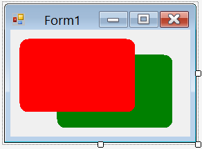

# Round Corner Control

To have a round corner control you can use either of the following solutions:

* You can make the control support transparent background and just fill the round rectangle area of it.
* You also have the option of setting the region of control to the round rectangle.
* 

Here in this example, I've use the second approach and set the region to the round rectangle. The difference between this approach and making transparent:

* Setting round region, the control has really round corners and you can see what is behind the round part despite when it is transparent, you will see background of form.

* Setting round region, when you click on removed rounded part, click pass through the region and reaches behind, but if you use transparency trick click on transparent region will handle by the control.

